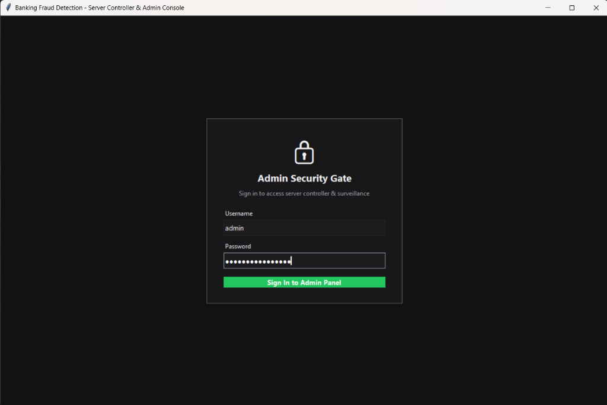
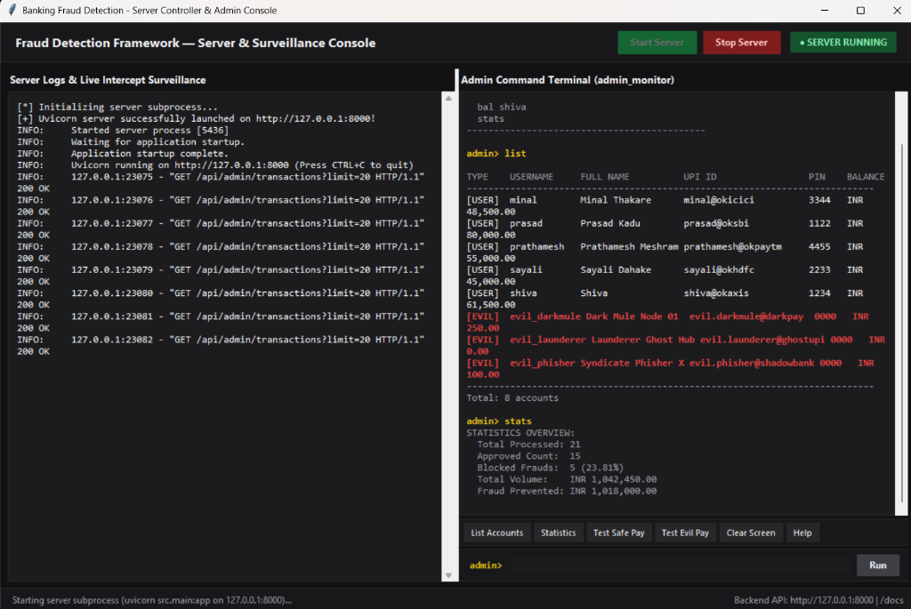

<div align="center">

# 🛡️ Smart Fraud Detection Framework for Digital Banking
### *Using Multi-Layered Predictive Modelling & Real-Time UPI Payment Simulation*

[](https://fastapi.tiangolo.com)
[](https://scikit-learn.org)
[](https://python.org)
[](https://sqlite.org)
[](https://streamlit.io)
[](LICENSE)

<br/>

**Production-ready, low-latency banking fraud interception framework with multi-layer ML inference and real-time transaction scoring.**

</div>

<br/>

---

## 📌 1. Project Overview & Problem Statement

Modern banking and digital finance process billions of retail transactions daily across digital wallets, card networks, and Unified Payments Interfaces (UPI). While cashless platforms offer instant convenience, they have introduced major security vulnerabilities, including authorized push payment scams, account takeovers, and fraudulent money transfers.

Legacy transaction inspection methods rely on static `if-else` thresholds (e.g., flagging transactions exceeding a fixed rupee cap). These mechanisms exhibit critical limitations:
- They **cannot evaluate non-linear relationships** across multivariate features (amount-to-balance ratio, sudden depletion velocity, transfer anomalies).
- They generate **excessive false positives**, disrupting legitimate transactions.
- Standalone ML models kept in Jupyter notebooks lack **functional software testing workflows** for end-user client applications.

### 💡 The Solution
This project delivers a production-grade, zero-cost, CPU-optimized **Backend Inference Server & Real-time Fraud Scoring Framework**. It combines deterministic heuristic rules, contextual behavioral engines, supervised ensemble classifiers, and unsupervised anomaly detection to evaluate transactions in **under 15 milliseconds**.

<br/>

---

## 🧠 2. Multi-Layer Detection Architecture

Fraud is never evaluated through a single mechanism. The system employs a 4-tier decision pipeline:

```
  Incoming Payment Payload (From Mock UPI App / Mobile Client)
                             │
                             ▼
 ┌───────────────────────────────────────────────────────────────┐
 │ Layer 1: Deterministic Heuristic Rule Engine                  │
 │ • Insufficient balance check                                  │
 │ • Blacklisted recipient / syndicate mule check                │
 │ • Extreme one-shot depletion (>95% total balance)             │
 └───────────────────────────┬───────────────────────────────────┘
                             ▼
 ┌───────────────────────────────────────────────────────────────┐
 │ Layer 2: Contextual Behavioral Feature Engine                 │
 │ • amount_to_balance_ratio                                     │
 │ • balance_drain_velocity                                      │
 │ • sudden_depletion_flag                                       │
 └───────────────────────────┬───────────────────────────────────┘
                             ▼
 ┌───────────────────────────────────────────────────────────────┐
 │ Layer 3: Dual-Engine Machine Learning Inference               │
 │ • Supervised Random Forest Classifier (Trained on PaySim dist)│
 │ • Unsupervised Isolation Forest (Zero-Day Anomaly Detection)  │
 └───────────────────────────┬───────────────────────────────────┘
                             ▼
 ┌───────────────────────────────────────────────────────────────┐
 │ Layer 4: Risk Tiering & Explanation Codes                     │
 │ • [ APPROVED ] -> Risk Score < 0.40  (Balances Updated)       │
 │ • [ FLAGGED  ] -> Risk Score 0.40 - 0.74 (Step-up Verification│
 │ • [ BLOCKED  ] -> Risk Score >= 0.75 (Critical Interception)  │
 └───────────────────────────────────────────────────────────────┘
```

<br/>

---

## ⚡ 3. Key Technical Highlights

- **Zero-Cost & Zero GPU Requirement**: Uses balanced CPU-threaded Random Forest training. Runs in under 5 seconds on standard dual/quad-core processors without heating or GPU usage.
- **Microsecond Latency**: Average inference latency per transaction is **< 15 ms**.
- **Stateful Account Ledger**: Embedded SQLite persistence tracks live balances for legitimate users and flagged mule nodes.
- **Developer-Friendly Swagger Docs**: Interactive API playground hosted at `/docs`.
- **Live Terminal Surveillance**: ANSI-colored CMD monitoring feed with real-time blinking indicators for fraud auditing.

<br/>

---

## 👥 4. Pre-Configured Test Accounts

The database comes pre-seeded with 5 legitimate student accounts and 3 dummy syndicate evil nodes for live fraud testing:

### 🎓 Legitimate Users
| Username | Full Name | Personal UPI ID | PIN | Default Balance |
| :--- | :--- | :--- | :---: | :--- |
| `shiva` | Shiva | `shiva@okaxis` | `1234` | ₹ 80,000.00 |
| `prasad` | Prasad Kadu | `prasad@oksbi` | `1122` | ₹ 60,000.00 |
| `sayali` | Sayali Dahake | `sayali@okhdfc` | `2233` | ₹ 45,000.00 |
| `minal` | Minal Thakare | `minal@okicici` | `3344` | ₹ 50,000.00 |
| `prathamesh`| Prathamesh Meshram | `prathamesh@okpaytm` | `4455` | ₹ 55,000.00 |

### ⚠️ Flagged Evil / Mule Accounts
| Username | Entity Name | Flagged UPI ID | PIN | Status |
| :--- | :--- | :--- | :---: | :--- |
| `evil_darkmule` | Dark Mule Node 01 | `evil.darkmule@darkpay` | `0000` | Blacklisted Mule |
| `evil_phisher` | Syndicate Phisher X | `evil.phisher@shadowbank` | `0000` | Phishing Node |
| `evil_launderer`| Launderer Ghost Hub | `evil.launderer@ghostupi` | `0000` | Laundering Hub |

*Sending money to any `[EVIL]` account automatically triggers a blacklist block.*

<br/>

---

## 🚀 5. Getting Started & Setup

### Prerequisites
- Python 3.10 or higher
- Git

### Installation
```bash
# Clone the repository
git clone https://github.com/your-username/fraud-detection-framework.git
cd fraud-detection-framework

# Install lightweight dependencies
pip install -r requirements.txt
```

<br/>

---

---

## 🖥️ 6. Graphical Server Controller & Surveillance Dashboard (Tkinter GUI)

For the easiest experience, launch the unified desktop management application:

```bash
python server_ui.py
```

### 🔐 1. Admin Security Gate
Access to the server controller and surveillance console is protected by an administrative security gate. Credentials can be configured via environment variables (`ADMIN_USER` and `ADMIN_PASS`) or set in your local deployment configuration.

<p align="center">
  
</p>

### 🛡️ 2. Live Server Controller & Admin Command Terminal
Combines start/stop controls, live server request streaming, real-time transaction surveillance alerts, and an interactive admin command console.

<p align="center">
  
</p>

#### Features:
- **Server Process Control**: One-click **Start Server** and **Stop Server** buttons with status indicators (`SERVER RUNNING` / `SERVER STOPPED`).
- **Live Server Logs**: Streams all Uvicorn backend logs with colorized transaction intercept alerts.
- **Colorized Badges**: Instant visibility for `APPROVED` (Green), `BLOCKED` (Red), and `PENDING` (Yellow).
- **Interactive Admin Terminal**: Run payment tests (`pay`), inspect balances (`bal`), list users (`list`), or view fraud statistics (`stats`).
- **Safe Offline Handling**: If the server is stopped when running a transaction, the system logs it as `PENDING` without freezing.

<br/>

---

## 💻 7. Command Line Workflow (Alternative to GUI)

If you prefer terminal-only operations, run the services across separate CMD windows:

### 📟 Terminal 1: Start the Backend Server via CLI
```bash
python run_server.py
```
- Prompts for confirmation before initializing.
- Automatically initializes the database and loads the trained ML models into memory.
- Streams live **A-Z request logs** in real-time.

---

### 📊 Terminal 2: Start the CMD Admin Surveillance Feed
```bash
python admin_monitor.py
```
- Real-time audit feed streaming directly from the backend.
- Displays:
  - Yellow blinking `[ ! ]` indicators around decision badges.
  - **`APPROVED`** events printed in bold **Green** with clear justification.
  - **`BLOCKED`** fraud alerts printed in bold **Red** with trigger reasons.

---

### 📱 Terminal 3: Launch the Payment App Simulator
```bash
streamlit run test_portal.py
```
- Opens at **`http://localhost:8501`**.
- Allows selecting sender accounts, viewing live balances, entering recipient UPI IDs (or selecting dummy evil nodes), and testing payment flows.

---

### ⚙️ Terminal 4: User & Account Management CLI
Manage bank accounts, modify PINs, or deposit/deduct balance using CLI arguments:

```bash
# View all registered accounts
python manage_users.py list

# Deposit money into an account
python manage_users.py add-balance --user shiva --amount 15000

# Deduct money from an account
python manage_users.py deduct-balance --user prasad --amount 5000

# Change an account password / UPI PIN
python manage_users.py set-pin --user sayali --pin 7788

# Register a new user
python manage_users.py create --username rohit --name "Rohit Sharma" --pin 1234 --balance 30000

# Register a new evil mule dummy
python manage_users.py create --username hacker_bot --name "Hacker Bot" --pin 0000 --balance 0 --evil
```

<br/>

---

## 📡 7. API Reference for External Integrations

The backend exposes clean REST endpoints for binding with external frontends:

### `POST /api/payment/process`
Evaluates and scores a live payment attempt.

**Request Body:**
```json
{
  "sender_id": "shiva@okaxis",
  "receiver_id": "prasad@oksbi",
  "transaction_type": "TRANSFER",
  "amount": 2500.0,
  "pin": "1234"
}
```

**Response (`APPROVED`):**
```json
{
  "transaction_id": "TXN_7B894F1C02",
  "sender_id": "shiva@okaxis",
  "receiver_id": "prasad@oksbi",
  "amount": 2500.0,
  "status": "APPROVED",
  "risk_score": 0.0,
  "risk_level": "LOW",
  "supervised_ml_prob": 0.0,
  "anomaly_detected": false,
  "reasons": ["Transaction verified and safe"],
  "sender_new_balance": 77500.0,
  "timestamp": "2026-10-05T03:00:00.000Z"
}
```

**Response (`BLOCKED`):**
```json
{
  "transaction_id": "TXN_98D234A5F1",
  "sender_id": "shiva@okaxis",
  "receiver_id": "evil.darkmule@darkpay",
  "amount": 75000.0,
  "status": "BLOCKED",
  "risk_score": 1.0,
  "risk_level": "CRITICAL",
  "supervised_ml_prob": 1.0,
  "anomaly_detected": true,
  "reasons": [
    "Blacklist Trigger: Receiver evil.darkmule@darkpay is a known flagged syndicate/mule node",
    "Critical Account Depletion: Over 95% of total balance being transferred in single shot",
    "Supervised ML Fraud Risk Alert (Confidence: 100.0%)"
  ],
  "sender_new_balance": 80000.0,
  "timestamp": "2026-10-05T03:00:15.000Z"
}
```

### Other Endpoints:
- `GET /api/accounts` — Fetch all registered accounts with live balances.
- `GET /api/admin/transactions?limit=50&status=BLOCKED` — Stream recent transactions.
- `GET /api/admin/stats` — Overall KPIs (total volume, blocked rate, fraud prevented).

<br/>

---

## 📂 8. Repository Structure

```
College Project/
│
├── src/
│   ├── ml_engine/
│   │   ├── train.py           # CPU-optimized training pipeline (PaySim synthesis + RF)
│   │   └── evaluator.py       # Multi-layer scoring & decision engine
│   ├── db/
│   │   └── database.py        # SQLite schema, accounts state & audit logger
│   ├── models/
│   │   └── fraud_model.pkl    # Serialized model pipeline (RF + Isolation Forest)
│   └── main.py                # FastAPI core application with CORS & REST routes
│
├── run_server.py              # Interactive server bootstrapper with startup prompt
├── admin_monitor.py           # Terminal live surveillance monitor with blinking ANSI badges
├── manage_users.py            # CLI tool for executing payments, balances, accounts, and PINs
├── test_api.py                # Automated integration test script
├── database.sqlite            # Embedded SQLite persistent store
├── ACCOUNTS_DIRECTORY.txt     # List of all user UPI IDs, names, PINs, and balances
├── COMMANDS_REFERENCE.txt     # Complete CMD commands reference cheatsheet
├── requirements.txt           # Project dependencies
└── README.md                  # Comprehensive documentation
```

<br/>

---

## 📄 License
This project is licensed under the MIT License.

<br/>

<div align="center">
  <b>Built for secure, reliable, and intelligent digital banking ecosystems.</b>
</div>
